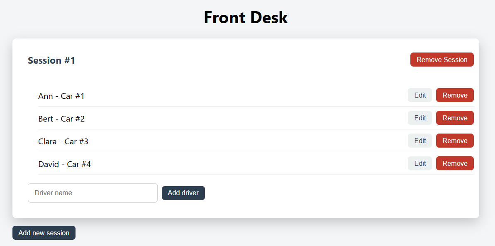
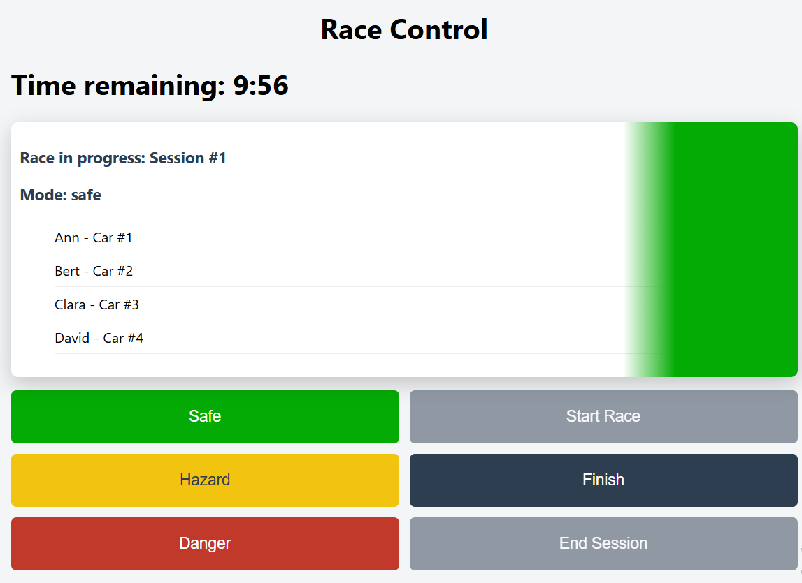
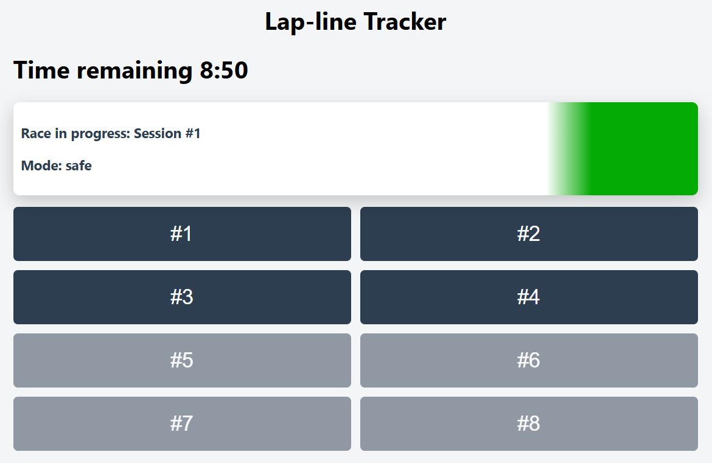
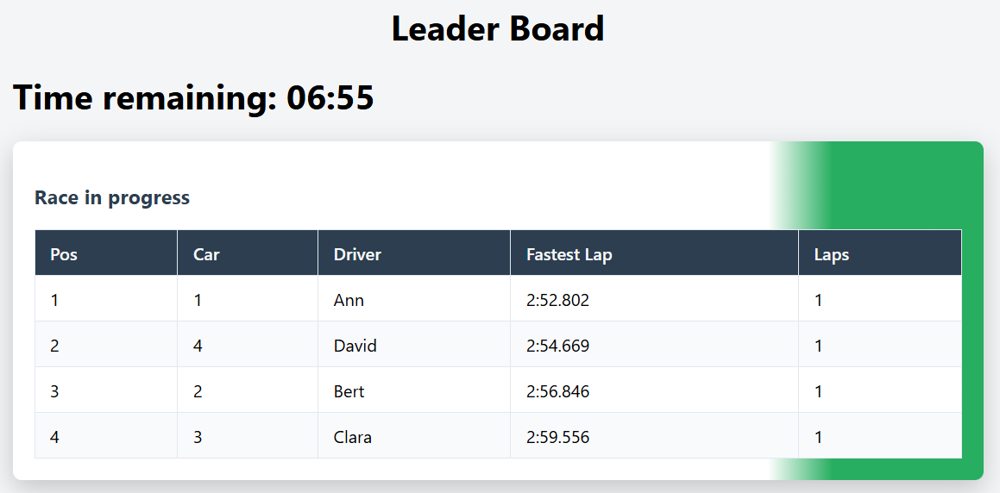
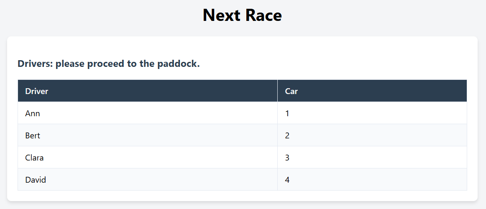

# Racetrack Info-Screens System

A modularized real-time racetrack management and public display application powered by Express and Socket.IO.

## Project Structure

- `public/` - Frontend assets and HTML views
    - `displays/` - Public info screens (leaderboard, flags, etc.)
    - `employee/` - Staff interfaces (front-desk, race-control, etc.)
- `server/` - Backend application logic and routes
    - `index.js` - Server entry point
    - `routes.js` - First-level route definitions

Even though the files live in `public/displays/` and `public/employee/` 
subfolders, every interface is still reachable through a 
**first-level route** via explicit mappings in `server/routes.js`.

## Setup & Installation

### 1. Install dependencies:
```bash
npm install
```

### 2. Configure environment variables:

Create a **.env** file in the root directory based on **.env.example**:<br>
`receptionist_key=your_key_here`<br>
`observer_key=your_key_here`<br>
`safety_key=your_key_here`

These three keys are required — **the server will not start** if any of them is missing.

### 3. Start the application:

```bash
npm start
```
This runs each race with the full **10 minute** timer.

For quicker testing, run:

```bash
npm run dev
```
This shortens every race timer to **1 minute** instead of 10.

### 4. Network accessibility: 
The server listens on all network interfaces by default. Access it via your local IP address or tunnel it via ngrok:

```bash
ngrok http 3000
```

## Routes

**Employee Interfaces** *(require an access key — see [Security](#security) below)*<br>
`/front-desk` - Reception and registration view<br>
`/race-control` - Core race management<br>
`/lap-line-tracker` - Timing and tracking interface

**Public Displays** *(no login required)*<br>
`/leader-board` - Live standings and rankings<br>
`/next-race` - Upcoming race lineup<br>
`/race-countdown` - Pre-race timer display<br>
`/race-flags` - Real-time signal flag status

## Security

- Employee interfaces prompt for an access key before enabling real-time control actions.

- Each role uses a distinct key matching the .env configuration.

- Failed logins trigger a 500ms delay before responding with an error.

## User Guide

### 1. Receptionist (`/front-desk`)

1. Open `/front-desk` and enter the receptionist access key.
2. Click **"+ Add new race session"** to queue up a new session.
3. Add driver names to automatically assign free car numbers, or edit/reassign cars from the dropdowns.



### 2. Safety Official (`/race-control`)

1. Open `/race-control` and enter the safety access key.
2. Review drivers and click **Start race**.
3. Use mode buttons (**Safe / Hazard / Danger / Finish**) to control track flags in real time.
4. Click **End race session** once cars return to the pit lane.



### 3. Lap-line Observer (`/lap-line-tracker`)

1. Open `/lap-line-tracker` and enter the observer key.
2. Tap a car's button each time it crosses the lap line.



### 4. Spectators (`/leader-board`)

Live public displays for standings, timers, and active safety flags placed around the track.



### 5. Race drivers (`/next-race`)

Displays upcoming racers and assigned car numbers for paddock viewing.



### 6. Race Flags & Countdown (`/race-flags`, `/race-countdown`)

Full-screen public displays meant for monitors placed around the track.

## Additional Features

- **Custom car selection**: the Receptionist can manually assign a driver to a specific car instead of relying only on automatic assignment.